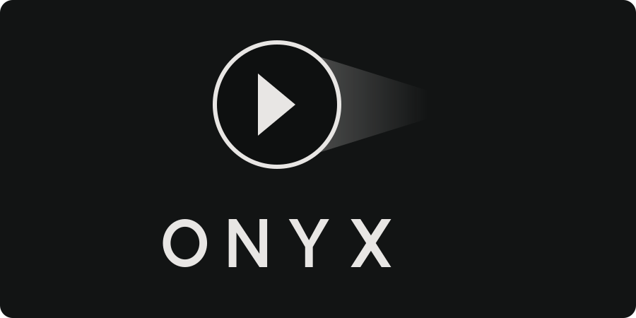

<div align="center">



### Ton cinéma privé. Léger, rapide, sans compromis.

Onyx est un serveur multimédia auto-hébergé et son application, pensés pour une bibliothèque personnelle : **Direct Play en priorité**, un serveur qui consomme moins de 20 Mo de RAM, et un lecteur que tu personnalises comme tu veux.


</div>

---

## 📸 Aperçu

| Accueil | Fiche détail |
|:---:|:---:|
|  |  |

| Lecteur |
|:---:|
|  |

| Regarder ensemble | Mobile |
|:---:|:---:|
|  |  |

---

## ✨ Fonctionnalités

### 🎬 Lecture
- **Direct Play pur** : le fichier est servi tel quel (HTTP Range, `206 Partial Content`), le seek est instantané et le CPU du serveur reste au repos.
- **Transcodage de secours** avec une échelle de débits, et un encodeur matériel si tu en as un.
- Décodage côté client via **mpv / media_kit**, et **ExoPlayer** sur Android.
- Pistes audio et sous-titres, downmix stéréo avec dialogues mis en avant.
- Aperçus sur la barre de lecture, saut d'intro, épisode suivant automatique.
- Image dans l'image, touches média du clavier.

### 👥 Regarder ensemble
- Des watch parties synchronisées : pause, lecture et seek sont partagés en temps réel entre tous les participants.

### 📚 Médiathèque
- Indexation automatique des films et séries (saisons / épisodes, motifs `SxxExx`), nettoyage des noms de fichiers.
- Surveillance des dossiers : les nouveaux fichiers apparaissent tout seuls.
- Identification des médias : affiches, fiches, casting, collections.
- Reprise de lecture synchronisée entre appareils, et même entre plusieurs serveurs liés.

### 🔐 Comptes et partage
- Le premier compte devient propriétaire. Les autres rejoignent sur **invitation**, avec des permissions fines.
- **Demandes de médias** pour les membres.
- Appairage d'une TV **par QR code**, sans taper de mot de passe.
- Connexion par QR sur le web et le desktop.

### 📥 Hors ligne
- Téléchargements pour regarder sans connexion, avec une réserve d'espace et un respect du réseau mobile facturé.

---

## 📱 Plateformes

| Plateforme | Statut |
|---|---|
| 🪟 Windows | ✅ avec mise à jour automatique |
| 🍎 macOS | ✅ |
| 🤖 Android / Android TV | ✅ |
| 📱 iOS | ✅ |
| 📺 Apple TV (tvOS) | ✅ |
| 🌐 Web | ✅ |

---

## 💎 Gratuit, Premium et offre fondateur

Onyx est en **beta** : aujourd'hui, tout est gratuit.

- **Gratuit, pour toujours** : le serveur, ta médiathèque, et la lecture en Direct Play sur toutes les plateformes. Aucun compte cloud, aucune limite de durée.
- **Onyx Premium, à la sortie de la beta** : une offre payante financera le développement et les frais de publication sur les stores. Elle portera sur des fonctions avancées, jamais sur la lecture de tes propres fichiers. La liste exacte et les prix seront publiés avant la fin de la beta, avec un achat à vie en plus de l'abonnement.
- **Offre fondateur** : si tu installes un serveur pendant la beta, tu gardes Onyx Premium à vie, gratuitement. C'est notre façon de remercier celles et ceux qui testent et remontent des bugs.

Une règle que l'on s'impose : ce qui est gratuit dans la version stable le reste.

---

## 🏗️ Architecture

```
┌────────────────────────┐        HTTP / Range         ┌────────────────────────┐
│   App Onyx (Flutter)   │  ◄───────────────────────►  │   Serveur Onyx (Go)    │
│  mpv · ExoPlayer · UI  │        API REST + WS        │  SQLite (WAL) · ffmpeg │
└────────────────────────┘                             └───────────┬────────────┘
                                                                   │
                                                         📁 Tes films et séries
```

| Dossier | Contenu |
|---|---|
| [`server/`](server/) | Serveur Go : API, indexeur, streaming, transcodage |
| [`app/`](app/) | Application Flutter multiplateforme |
| [`brand/`](brand/) | Logo, icônes, identité visuelle |
| [`docs/adr/`](docs/adr/) | Les décisions d'architecture, une par fichier |

---

## 🚀 Démarrage rapide

### Serveur (Docker)

```bash
mkdir -p data media/Films media/Series
```

```bash
docker compose up -d --build
```

Le serveur tourne sur **http://localhost:8080**. Le premier compte créé devient le propriétaire.

La documentation complète de l'API est dans [`server/README.md`](server/README.md).

### Application

```bash
cd app
```

```bash
flutter pub get
```

```bash
flutter run
```

---

## 🧭 Philosophie

1. **Le contenu est le héros.** L'interface s'efface pendant la lecture.
2. **Direct Play d'abord.** On ne transcode que quand on n'a pas le choix.
3. **Léger.** Un serveur qui tourne sur un Raspberry Pi comme sur un NAS.
4. **Contrôle total.** Tes fichiers, ton serveur, aucun cloud.

---

## 🤝 Contribuer

Les rapports de bugs, les idées et les pull requests sont les bienvenus. Lis [CONTRIBUTING.md](CONTRIBUTING.md) avant d'ouvrir une PR : elle suppose d'accepter l'[accord de contribution](CLA.md).

---

## 📄 Licence

**© 2026 Tsuky.** Onyx est en **source disponible**, sous licence [PolyForm Noncommercial 1.0.0](LICENSE).

- ✅ Tu peux lire le code, installer Onyx, le modifier et le partager pour un usage **non commercial** : chez toi, pour ta famille et tes amis.
- ❌ Tout usage commercial (revente, offre d'hébergement payante, intégration dans un produit vendu) demande une licence écrite de l'auteur.
- Le nom « Onyx » et le logo ne sont pas couverts par la licence : une version modifiée doit être distribuée sous un autre nom.

Onyx n'est pas un logiciel open source au sens de l'OSI : le code est ouvert à la lecture et à la contribution, pas à la réutilisation commerciale.
